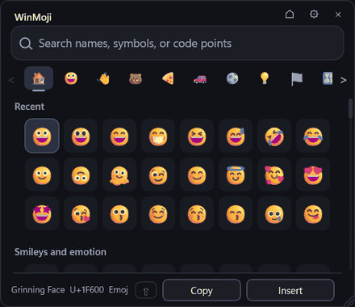
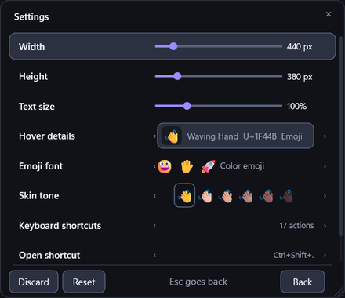
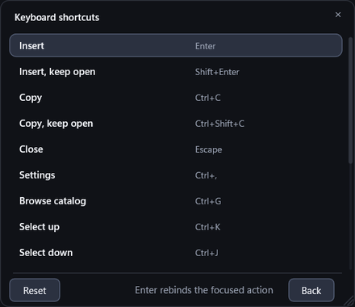

# WinMoji

WinMoji is a fast keyboard-first Unicode picker for Windows. It stays resident, opens a small native popup, searches offline, and inserts the selected character without using the clipboard.



The catalog contains the full Unicode 17 emoji set plus named Unicode symbols, arrows, math, currency, punctuation, Greek, shapes, common technical characters, and classic text emoticons. There are no GIFs, stickers, or network requests.

## Use

Run `winmoji.exe` to show the picker. The default global shortcut is `Ctrl+Shift+.`. The built-in Windows emoji panel answers to `Win+.` and `Win+;`, and the shell holds both registrations, so no application can take them; WinMoji sits next to it rather than replacing it. Change the shortcut in settings or the configuration file.

Type to search. Misspellings, transposed letters, and stray punctuation still match. Results are ranked by match quality and by what you have picked before, so choosing an entry for a query lifts it above rivals next time. An empty search lists the catalog by most recent use, and `Ctrl+G` browses it in the same window.

Hover or focus a character to show its name, code point, and type in the footer. Right-click an emoji that supports skin tones to pick a variant for one insert; the permanent default is a settings row that applies everywhere.

The footer carries Copy and Insert beside a Shift cap. Holding Shift lights the cap and both buttons switch to their keep-open form. Clicking the cap latches that state without the key, for as long as the picker is open.

### Keyboard

Every action below is rebindable from the Keyboard shortcuts page in settings.

| Action | Chord |
| --- | --- |
| Insert | `Enter` |
| Insert, keep open | `Shift+Enter` |
| Copy | `Ctrl+C` |
| Copy, keep open | `Ctrl+Shift+C` |
| Close | `Escape` |
| Settings | `Ctrl+,` |
| Browse catalog | `Ctrl+G` |
| Select up | `Ctrl+K` |
| Select down | `Ctrl+J` |
| Select left | `Ctrl+H` |
| Select right | `Ctrl+L` |
| Half page up | `Ctrl+U` |
| Half page down | `Ctrl+D` |
| Scroll page up | `Page Up` |
| Scroll page down | `Page Down` |
| Larger text | `Ctrl+=` |
| Smaller text | `Ctrl+-` |

The arrow keys and the search field are fixed, because they are the primitives the rest is shorthand for. For the same reason a bare letter or punctuation chord is refused: the field would swallow it before any action saw it. A chord another action already owns is refused rather than taken.

These are fixed, and edit the search field rather than the selection:

| Action | Chord |
| --- | --- |
| Move the caret | `Left`, `Right`, `Home`, `End` |
| Extend a selection | `Shift` with any caret key |
| Select everything | `Ctrl+A` |
| Paste into the search | `Ctrl+V` |
| Delete the previous word | `Ctrl+Backspace` |

Clicking in the search field puts the caret where you click, and dragging from there selects a range. `Left` and `Right` move the caret whenever a query is typed; with the field empty they move the grid selection instead, since there is no caret to carry.

The scrollbar takes a direct drag and its grip grows under the pointer. The mouse wheel browses smoothly, the category rail scrolls with a vertical or horizontal wheel gesture while hovering it, and category focus follows the visible section. PrintScreen and Win-key shortcuts pass through while the picker is open, so system screenshots keep working.

### Insertion behaviour

WinMoji opens without activating its window. Search and navigation keys are captured while the original control remains focused, so transient fields such as inline rename editors stay open, and capture is released before UTF-16 input goes into that exact control. The picker closes if another application becomes active.

Copying reaches the places insertion cannot. Windows UIPI blocks input into an elevated application when WinMoji is not elevated, and applications with custom controls can ignore `KEYEVENTF_UNICODE`; in that case WinMoji cancels rather than sending text to a different window.

## Configure

 

The settings panel changes every value below without editing a file. Enter changes the focused value with wrap-around and previews immediately, Escape and Back save and return, Discard restores the values from when settings opened, and Reset restores stock defaults.

The optional configuration file is `%APPDATA%\winmoji\config.toml`:

```toml
hotkey = "Ctrl+Shift+."
width = 440
height = 380
font_scale = 100
details = "both"
emoji_font = "Segoe UI Emoji"
skin_tone = "default"
```

| Key | Accepts | Default |
| --- | --- | --- |
| `hotkey` | A chord, see below | `Ctrl+Shift+.` |
| `width` | 360 to 920 | `440` |
| `height` | 300 to 760 | `380` |
| `font_scale` | 80 to 160, a percentage | `100` |
| `details` | `none`, `type`, `codepoint`, `both` | `both` |
| `emoji_font` | `Segoe UI Emoji`, `Segoe UI Symbol` | `Segoe UI Emoji` |
| `skin_tone` | `default`, `light`, `medium-light`, `medium`, `medium-dark`, `dark` | `default` |
| `key_<action>` | A chord, one line per rebound action | The table above |

`width` and `height` are clamped to the active monitor work area. Each `key_<action>` line takes the same form as `hotkey`, except that these may be bare keys.

A chord combines any of the modifiers `Ctrl`, `Alt`, `Shift`, and `Win` with one key: a letter, a digit, `F1` through `F24`, `Space`, `Enter`, `Tab`, `Escape`, the arrows, `Page Up`, `Page Down`, `Home`, `End`, `Insert`, `Delete`, `Backspace`, or punctuation. Punctuation accepts its literal form or a name: `period`, `comma`, `slash`, `backslash`, `semicolon`, `apostrophe`, `minus`, `equals`, `left bracket`, `right bracket`, `grave`. The global `hotkey` always uses `MOD_NOREPEAT`.

The responsive popup uses Direct2D and DirectWrite, with continuous width and height controls, Segoe UI Emoji colour glyphs or monochrome Segoe UI Symbol glyphs, and a clickable control for every search, browse, insert, and settings action.

## Start with Windows

`winmoji.exe --install` copies the executable to `%LOCALAPPDATA%\Programs\WinMoji\winmoji.exe`, adds that stable path to the current user's `HKCU` Run entry, and starts the hotkey listener immediately. `winmoji.exe --uninstall` removes the startup entry. Both are idempotent and need no elevation. Add `--dry-run` to inspect the target without changing the registry.

## Command line

| Command | Effect |
| --- | --- |
| `winmoji` | Show the picker, or show the running instance |
| `winmoji --startup` | Start the hotkey listener without opening the popup |
| `winmoji --preview` | Keep the window visible when it loses focus |
| `winmoji --install` | Add WinMoji to the current user's startup apps |
| `winmoji --uninstall` | Remove the startup entry |
| `winmoji --self-test` | Test search, hotkey registration, and Unicode input |
| `winmoji --benchmark` | Measure full-catalog search latency |
| `winmoji --help` | Show the command list |

`--dry-run` pairs with `--install` and `--uninstall`.

## Build and verify

```text
cargo +stable-msvc test
cargo +stable-msvc clippy --all-targets -- -D warnings
cargo +stable-msvc build --release --features console
target\release\winmoji.exe --self-test
target\release\winmoji.exe --benchmark
cargo +stable-msvc build --release
```

WinMoji builds with the MSVC toolchain and a Windows SDK. `stable-msvc` resolves to the host's MSVC toolchain; `rustup default stable-msvc` removes the need for the prefix. `x86_64-pc-windows-msvc` and `aarch64-pc-windows-msvc` are both supported, and adding `--target <triple>` cross-compiles to the other, placing the binary under `target\<triple>\release\`.

The `console` feature keeps diagnostic output attached to the terminal, which `--self-test` and `--benchmark` need to report anywhere other than a message box. `--self-test` also needs an interactive desktop session, because Windows rejects foreground changes from background runners. The final command produces the default Windows-subsystem binary, so startup and ordinary launches do not create a console window.

## License

MIT. Third-party attribution is in `THIRD_PARTY_NOTICES.md`.
